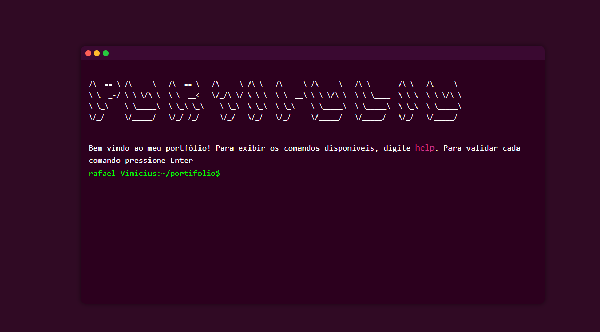

<h1 align="center">
   
  
   
Portfolio Terminal 
</h1>
<h4 align="center">Apresentação de meu portfólio em forma de terminal. Os comandos de um terminal real podem ser usados no site, mas se você não souber como usá-los, será facilmente orientado</h4>
 

## WEB version 🌐

O site está no ar aqui 👉 [portfolio](https://rafavini.github.io/)
## Creditos e inspiração 🔗
[Guillaume Reygner](https://github.com/guillaume-rygn)